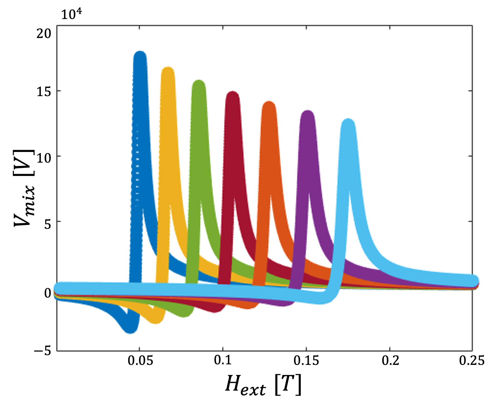

# STFMR Analysis (Smith–Beljers)
Computation, simulation, and fitting utilities for spin‑torque ferromagnetic resonance (ST‑FMR) of thin films using the Smith–Beljers formalism. This repo includes scripts to (i) compute equilibrium magnetization, (ii) evaluate small‑angle dynamics and line shapes (symmetric/antisymmetric Lorentzians), (iii) model Oersted and spin‑torque effective fields, and (iv) fit measured spectra to extract resonance field and linewidth.

> **TL;DR**: Open `STFMR_Analysis_SmithBeljers.m` in MATLAB and run. For measured data, call `fit_func_STFMR(field, volt)` to get [width, H_res, A_sym, A_asym, offset].

---

## Contents
```
.
├── src/
│   ├── STFMR_Analysis_SmithBeljers.m   # Main simulation/plot script
│   ├── find_steady_state.m             # θ₀,φ₀ from energy stationarity (Zeeman + demag + Ku + STT)
│   ├── find_perturbations.m            # Small‑angle response (δθ, δφ) near resonance
│   ├── fit_func_STFMR.m                # Nonlinear fit of ST‑FMR line shape
│   ├── AMR_factor.m                    # Anisotropic MR angular factor vs φ
│   ├── shape_anisotropy.m              # Demagnetizing factors (Osborn 1945) + elliptic integrals
│   └── F.m                             # Helper for Oersted field integrals of a strip
├── data/                               # (optional) Measured spectra: CSV/TXT with columns: field[T], voltage[V]
├── figs/                               # Final simulation figures for README/docs
└── docs/img/                           # Debug or “known‑case” screenshots during dev
```

---

## Requirements
- MATLAB R2020b or newer (recommended).
- **Optimization Toolbox** (used by `lsqnonlin`, `lsqcurvefit`).
- No third‑party dependencies beyond base MATLAB.

---

## Quick start
1. Clone and open in MATLAB. In the **Command Window**:
   ```matlab
   addpath(genpath('src'));
   % Run the main simulation/model:
   STFMR_Analysis_SmithBeljers
   ```
2. (Optional) Place your measured spectrum in `data/` as two equal‑length vectors of field (Tesla) and voltage (Volt). Example fit:
   ```matlab
   load('data/example_spectrum.mat');  % expects variables: field, volt
   p = fit_func_STFMR(field, volt);    % -> [width, Hres, Asym, Aasym, offset]
   ```
3. Figures are saved or displayed from the main script; export representative ones to `figs/` for documentation.

---

## File‑by‑file overview
- **`STFMR_Analysis_SmithBeljers.m`** — Main driver that sets physical constants and geometry (film thicknesses, width/length), builds the external field sweep and RF/Oersted fields, solves for equilibrium magnetization, computes small‑angle dynamics, and produces diagnostic plots (e.g., resonance vs frequency, ΔH vs f). Uses helper functions below.
- **`find_steady_state.m`** — Solves for the equilibrium angles \(\theta_0,\phi_0\) by setting \(\partial E/\partial\theta=0\) and \(\partial E/\partial\phi=0\) for the total energy (Zeeman + demagnetization + uniaxial anisotropy \(K_u\) + spin‑torque/DC effective field). Internally calls `lsqnonlin` with bounds \(\theta\in[0,\pi],\;\phi\in[0,2\pi]\).
- **`find_perturbations.m`** — Linearizes around \((\theta_0,\phi_0)\) to compute small‑angle responses \(\delta\theta,\delta\phi\) under RF effective fields: Oersted (AC) and STT (AC/DC). Includes second derivatives of the energies and damping line‑shape, consistent with Smith–Beljers susceptibility.
- **`fit_func_STFMR.m`** — Nonlinear least‑squares fit to a mixed symmetric/antisymmetric Lorentzian:
  \[ V(H) = A_\mathrm{{sym}}\frac{(\tfrac{\Delta H}{2})^2}{(H-H_\mathrm{{res}})^2+(\tfrac{\Delta H}{2})^2}
          + A_\mathrm{{asym}}\frac{(\tfrac{\Delta H}{2})^2}{(H-H_\mathrm{{res}})^2+(\tfrac{\Delta H}{2})^2}\cdot\frac{H-H_\mathrm{{res}}}{\tfrac{\Delta H}{2}} + V_0 \]
  Returns parameter vector: `[ΔH, H_res, A_sym, A_asym, V0]`. Initial guesses are inferred from min/max of the input trace.
- **`AMR_factor.m`** — Empirical/Polynomial AMR factor vs \(\phi\) (radians) calibrated on this sample; used to convert small precession into resistance change.
- **`shape_anisotropy.m`** — Demagnetizing factors (Na,Nb,Nc) for ellipsoids in special limits (sphere/rod/disk). Includes simple numerical elliptic integrals for general cases.
- **`F.m`** — Helper analytic integral used to compute the strip Oersted field components for a finite thickness/width.

---

## Typical workflow
1. **Choose geometry & materials** in `STFMR_Analysis_SmithBeljers.m` (film thicknesses, width/length, Ms, Ku, damping, current densities).
2. **Define field/frequency sweeps** and the in‑plane angle of \(\mathbf{{H}}_\text{{ext}}\).
3. **Solve equilibrium** with `find_steady_state` to obtain \(\theta_0,\phi_0\).
4. **Compute RF response** with `find_perturbations` to obtain \(\delta\phi\) and apply `AMR_factor` to convert to \(\Delta R\).
5. **Generate synthetic line shapes** and (optionally) **fit measured spectra** with `fit_func_STFMR` to extract \(H_\mathrm{{res}}\) and \(\Delta H\).
6. **Save plots** to `figs/` and drop a few into the README.

---

## Reproducing the figures
Add a few curated outputs to `figs/` and reference them here with relative paths. For example:
- **Resonance Field vs Frequency** (\(H_\mathrm{{res}}(f)\)):  
  
- **Linewidth vs Frequency** (\(\Delta H(f)\)):  
  
- **Example ST‑FMR Spectrum**:  
  

> Place raw development/debug images under `docs/img/` if you want to keep the README tidy.

---

## Debugging & Known Cases
Create a lightweight gallery of “known good” and “edge” scenarios that helped during development:
- **Sanity checks**: zero anisotropy (\(K_u=0\)), no STT (\(H_\text{{STT}}=0\)), large demag asymmetry (thin disk) vs near‑sphere.
- **Angle sweeps**: \(\phi_H\in[0,2\pi)\) to verify AMR symmetry and sign of antisymmetric component.
- **Thickness/width scans**: confirm Oersted scaling via `F.m` and correct units (Tesla).

Place screenshots in `docs/img/` and list them here, e.g.:
- `docs/img/sanity_no_STT.png` — no STT, symmetric Lorentzian only.
- `docs/img/phi_sweep_45deg.png` — antisymmetric sign flip at \(\phi_H+90^\circ\).
- `docs/img/linewidth_vs_f.png` — linear \(\Delta H(f)\) as expected from Gilbert damping.

---

## Data format (for measured spectra)
- **Units**: field in **Tesla**, voltage in **Volts** (SI).
- **CSV**: two columns named `field,volt` (headers optional).  
  ```csv
  field,volt
  0.1342, 2.7e-6
  0.1351, 3.1e-6
  ...
  ```
- **MAT**: variables `field` and `volt` as equal‑length vectors.

---

## Notes on units and constants
- `miu0 = 4π·10⁻⁷ H/m` (SI).  
- `Ms` in **A/m**, fields in **Tesla**.  
- Current density `Jc_ac` in **A/m²**; Oersted fields computed in **Tesla**.

---

## Testing
- Add a tiny synthetic spectrum generator (future) and compare recovered `[ΔH, Hres]` from `fit_func_STFMR` against ground truth.
- Use “no anisotropy, no STT” as a baseline unit test — should yield purely symmetric lineshape.

---

## Contributing
1. Open an issue describing the feature/bug.
2. Fork → branch → PR with a focused change.
3. Include a small example and update this README if the public API changes.

---

## License
MIT (or your preferred license).

---

*Last updated: 2025-08-31*
